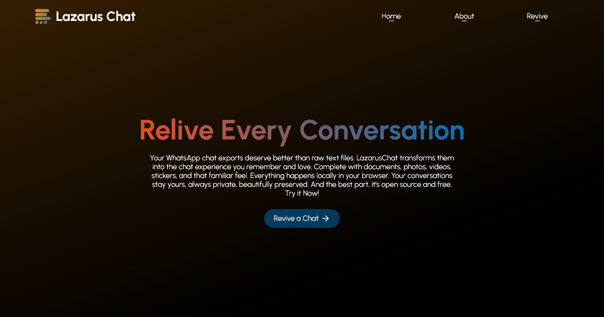

# LazarusChat

LazarusChat transforms the messy text files buried in ZIP files in your WhatsApp chat exports back into a readable chat format. No more reading raw TXT files. The chat interface is complete with documents, photos, videos, stickers and more will. Everything happens directly in the browser. No server uploads. Secure, private, open-source and free.

---

## Why LazarusChat?

- **Privacy**
  - When you use LazarusChat, everything runs on the client-side. Your data never leaves your device.
- **Open-source**
  - LazarusChat is completely open-source under the MIT License.
- **Free**
  - LazarusChat is completely free for everyone with no compromises.

***

## Technologies Used

| Technology | Used For                                      |
|:----------:|:---------------------------------------------:|
| HTML       | Website Structure                             |
| CSS        | Website Styling                               |
| JS         | Full Functionality, Interactivity and Process |
| JSZip      | ZIP archive processing and extracting         |

## Current Features

- Supported Export Types,
  - ZIP Archive (Media Included)
  - ZIP Archive (Without Media)
- Message Timestamps
- Name Tags
- Date Tags
- Displaying System Messages
- Displaying Media (Stickers/Images/Videos/Audio)
- Downloadable Documents (All non-media files)
- Image Viewer
- PDF Viewer
- Full-Screen Mode
- Self-Profile Selector

## Future Updates (Expected Features)

- Support Stand-Alone Text Files (.txt) as Exports
- Scroll to Bottom Button
- Add Loading Screen
- Implement Video Viewer
- Date Format Selector
- Time Format Selector

***

[

](https://lazarus-chat.netlify.app/)